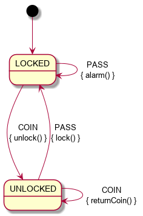
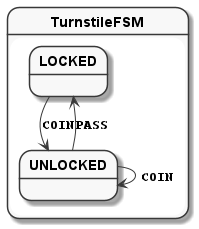
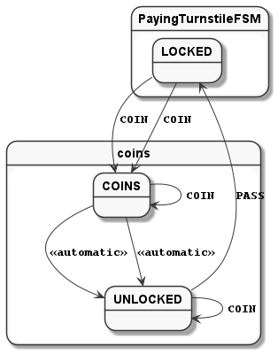
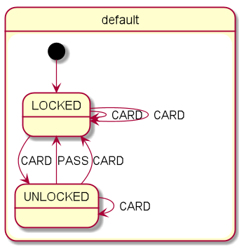
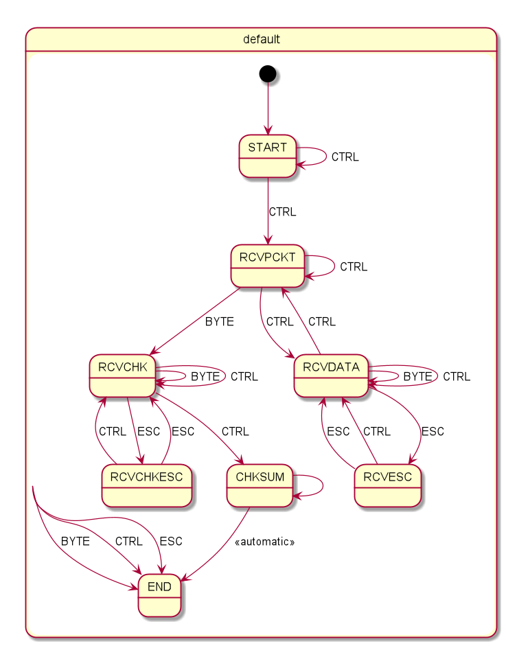

= Kotlin Finite-state machine

This is a small implementation of an FSM in Kotlin.

== Resources
* link:https://open.jumpco.io/projects/kfsm/index.html[Documentation]
* link:https://open.jumpco.io/projects/kfsm/javadoc/kfsm/index.html[API Docs]
* link:https://github.com/open-jumpco/kfsm-viz[Visualization Support kfsm-viz]
* link:https://github.com/open-jumpco/kfsm-samples[Sample Project]
* link:https://github.com/open-jumpco/kfsm-web[Turnstile Sample for Browser]
* link:https://github.com/open-jumpco/kfsm-kvision-web[Turnstile Sample with KVision for Browser]
* link:https://github.com/open-jumpco/kfsm-android[Turnstile Sample for Android]
* link:https://github.com/open-jumpco/kfsm-spring[Turnstile Sample for Spring MVC]
* link:https://github.com/open-jumpco/kfsm-spring-rest[Turnstile Sample for Spring HATEOAS]

== Getting Started

The state machine implementation supports events triggering transitions from one state to another while performing an optional action as well as entry and exit actions.

== Features
* Event driven state machine.
* External and internal transitions
* State entry and exit actions.
* Default state actions.
* Default entry and exit actions.
* Determine allowed events.
* Multiple state maps with push / pop transitions
* Automatic transitions
* Externalisation of state.
* Typed event parameters and return values.

== Todo
* [x] Multiple state maps
* [x] Push / pop transitions
* [x] Automatic transitions
* [x] Externalisation of state
* [x] Typed event parameters
* [x] Typed event return values
* [x] Simple Visualization
* [x] Detail Visualization
* [x] Gradle Plugin for Visualization
* [x] Timeouts
* [x] Corountines
* [ ] Different type of contexts for Nested statemaps

## Quick Tutorial
This is the classic turnstile FSM model from [SMC](http://smc.sourceforge.net/)

=== Simple turnstile example
Assume we and to manage the state on a simple lock.
We want to ensure that the `lock()` function is only called when the lock is not locked and we want `unlock()` to be called when locked.

Then we use the DSL to declare a definition of a statemachine matching the diagram:

==== State Diagram

==== State Table

|===
|Start State |Event |End State |Action

|LOCKED
|PASS
|LOCKED
|alarm

|LOCKED
|COIN
|UNLOCKED
|unlock

|UNLOCKED
|PASS
|LOCKED
|lock

|UNLOCKED
|COIN
|UNLOCKED
|returnCoin
|===

==== Context class
[source,kotlin,numbered]
----
class Turnstile(var locked: Boolean = true) {
    fun unlock() {
        assert(locked) { "Cannot unlock when not locked" }
        println("Unlock")
        locked = false
    }

    fun lock() {
        assert(!locked) { "Cannot lock when locked" }
        println("Lock")
        locked = true
    }

    fun alarm() {
        println("Alarm")
    }

    fun returnCoin() {
        println("Return coin")
    }
    override fun toString(): String {
        return "Turnstile(locked=$locked)"
    }
}
----

==== Enums for States and Events
We declare 2 enums, one for the possible states and one for the possible events.

[source,kotlin,numbered]
----
enum class TurnstileStates {
    LOCKED,
    UNLOCKED
}

enum class TurnstileEvents {
    COIN,
    PASS
}
----

==== Packaged definition and execution
[source,kotlin,numbered]
----
class TurnstileFSM(turnstile: Turnstile) {
    private val fsm = definition.create(turnstile)

    fun coin() = fsm.sendEvent(TurnstileEvents.COIN)
    fun pass() = fsm.sendEvent(TurnstileEvents.PASS)
    companion object {
        private val definition = stateMachine(
            TurnstileStates.values().toSet(),
            TurnstileEvents::class,
            Turnstile::class
        ) {
            initialState {
            if (locked)
                TurnstileStates.LOCKED
            else
                TurnstileStates.UNLOCKED
            }
            default {
                onEntry { startState, targetState, _ ->
                    println("entering:$startState -> $targetState for $this")
                }
                // default transition will invoke alarm
                action { state, event, _ ->
                    println("Default action for state($state) -> event($event) for $this")
                    alarm()
                }
                onExit { startState, targetState, _ ->
                    println("exiting:$startState -> $targetState for $this")
                }
            }
            // when current state is LOCKED
            whenState(TurnstileStates.LOCKED) {
                // external transition on COIN to UNLOCKED state
                onEvent(TurnstileEvents.COIN to TurnstileStates.UNLOCKED) {
                    unlock()
                }
            }
            // when current state is UNLOCKED
            whenState(TurnstileStates.UNLOCKED) {
                // internal transition on COIN
                onEvent(TurnstileEvents.COIN) {
                    returnCoin()
                }
                // external transition on PASS to LOCKED state
                onEvent(TurnstileEvents.PASS to TurnstileStates.LOCKED) {
                    lock()
                }
            }
        }.build()
    }
}
----

With this definition we are saying:
When the state is `LOCKED` and on a `COIN` event then transition to `UNLOCKED` and execute the lambda which is treated
as a member of the context `{ unlock() }`

When the state is `LOCKED` and on event `PASS` we perform the action `alarm()` without changing the end state.

==== Usage
Then we instantiate the FSM and provide a context to operate on:

[source,kotlin,numbered]
----
val turnstile = Turnstile()
val fsm = TurnstileFSM(turnstile)
----

Now we have a context that is independent of the FSM.

Sending events may invoke actions:
[source,kotlin,numbered]
----
// State state is LOCKED
fsm.coin()
// Expect unlock action end state is UNLOCKED
fsm.pass()
// Expect lock() action and end state is LOCKED
fsm.pass()
// Expect alarm() action and end state is LOCKED
fsm.coin()
// Expect unlock() and end state is UNLOCKED
fsm.coin()
// Expect returnCoin() and end state is UNLOCKED
----

This model means the FSM can be instantiated as needed if the context has values that represent the state. The idea is that the context will properly maintain it's internal state.

The FSM can derive the formal state from the value(s) of properties of the context.

The link:https://open.jumpco.io/projects/kfsm/index.html[Documentation] contains more detail on creating finite state machine implementations.

The documentation contains examples for:

* link:https://open.jumpco.io/projects/kfsm/index.html#advanced-features[Turnstile providing for coin values.]
* link:https://open.jumpco.io/projects/kfsm/index.html#secure-turnstile-example[Secure turnstile with card and override.]
* link:https://open.jumpco.io/projects/kfsm/index.html#packet-reader-example[Packet Reader finite state machine.]
* link:https://open.jumpco.io/projects/kfsm/index.html#immutable-context-example[ImmutableLock and FSM.]

=== Repository

Use this repository for SNAPSHOT builds. Releases are on Maven Central
[source,groovy]
----
repositories {
    maven {
        url 'https://oss.sonatype.org/content/groups/public'
    }
}
----
=== Dependencies
==== JVM Projects

[source,groovy]
----
dependencies {
    implementation 'io.jumpco.open:kfsm-jvm:1.0.2'
}
----

==== KotlinJS Projects

[source,groovy]
----
dependencies {
    implementation 'io.jumpco.open:kfsm-js:1.0.2'
}
----

==== Kotlin/Native Projects using LinuxX64

[source,groovy]
----
dependencies {
    implementation 'io.jumpco.open:kfsm-linuxX64:1.0.2'
}
----

==== Kotlin/Native Projects using MinGW64

[source,groovy]
----
dependencies {
    implementation 'io.jumpco.open:kfsm-mingwX64:1.0.2'
}
----

==== Kotlin/Native Projects using macOS

[source,groovy]
----
dependencies {
    implementation 'io.jumpco.open:kfsm-macosX64:1.0.2'
}
----

== Simple Visualisation

By using the StateMachineDefinition created by the DSL we do not have access to the details of guard expressions or actions.

For more detailed visualization use link:https://github.com/open-jumpco/kfsm-viz[kfsm-viz]

[source,kotlin]
----
@Test
fun produceVisualizationTurnstileFSM() {
    println("== TurnStile")
    val visualization = visualize(TurnstileFSM.definition)
    File("generated", "turnstile.plantuml").writeText(plantUml(visualization))
}
----

=== Plantuml

==== Turnstile FSM

link:./src/commonTest/kotlin/TurnstileTypes.kt[TurnstileTypes.kt]

==== Paying Turnstile FSM

link:./src/commonTest/kotlin/PayingTurnstileTypes.kt[PayingTurnstileTypes.kt]

==== Secure Turnstile FSM

link:./src/commonTest/kotlin/SecureTurnstile.kt[SecureTurnstile.kt]

==== Packer Reader FSM

link:./src/jvmTest/kotlin/PacketReaderTests.kt[PacketReaderTests.kt]

== Questions:
* Should entry / exit actions receive state or event as arguments?
* Should default actions receive state or event as arguments?
* Is there a more elegant way to define States and Events using sealed classes?
* Are any features missing from the implementation?
