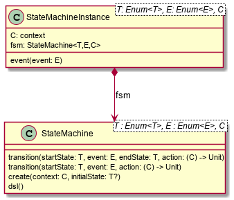

# Kotlin Finite-state machine

This is a small implementation of an FSM in Kotlin.
This model supports events that trigger may cause a transition from one state to another while performing an optional action.

Assume we and to manage the state on a simple lock.
We want to ensure that the `lock()` function is only called when the lock is not locked and we want `unlock()` to be called when locked.

http://smc.sourceforge.net/slides/SMC_Tutorial.pdf

```kotlin
class Turnstile(var locked: Boolean = true) {
    fun unlock() {
        assert(locked) { "Cannot unlock when not locked" }
        println("Unlock")
        locked = false
    }

    fun lock() {
        assert(!locked) { "Cannot lock when locked" }
        println("Lock")
        locked = true
    }

    fun alarm() {
        println("Alarm")
    }

    fun thankYou() {
        println("Thank You")
    }
    override fun toString(): String {
        return "Turnstile(locked=$locked)"
    }
}
```
We declare 2 enums, one for the possible states and one for the possible events.

```kotlin
enum class TurnstileStates {
    LOCKED,
    UNLOCKED
}

enum class TurnstileEvents {
    COIN,
    PASS
}
```

Then we use the DSL to declare a definition of a statemachine matching the diagram:


```kotlin
val definition = StateMachine<TurnstileStates, TurnstileEvents, Turnstile>().dsl {
    initial { if(it.locked) LOCKED else UNLOCKED }
    state(LOCKED) {
        event(COIN to UNLOCKED) { ts ->
            ts.unlock()
        }
        event(TurnstileEvents.PASS) { ts ->
            ts.alarm()
        }
    }
    state(UNLOCKED) {
        // event without an endState will not trigger entry or exit actions
        event(COIN) { ts ->
            ts.thankYou()
        }
        event(PASS to LOCKED) { ts ->
            ts.lock();
        }
    }
    default { // default state handler
        action { context, state, event ->
            println("Default action for $event in $state for $context")
            error("Should not be called with this definition")
        }
        entry { context, startState, endState ->
            println("Entering:$stateState -> $endState for $context")            
        }
        exit { context, startState, endState ->
            // will be invoke if state doesn't have exit defined.
            println("Existing:$stateState -> $endState for $context")            
        }
        event(PASS to LOCKED) { context, currentState, event ->
            // will be invoked for PASS event and will transition to LOCKED if no event it defined for the currentState
            // in this specific case the definition covers all possibilities to this will never be called
            error("Should not be called with this definition")
        }    
    }
}.build()
```

With this We are saying:
When the state is `LOCKED` and on a `COIN` event then transition to `UNLOCKED` and execute the code in the lambda `{ ts -> ts.unlock() }`

When the state is `LOCKED` and on `event(PASS)` we are perform the action `alarm()` without changing the end state.

Then we instantiate the FSM and provide a context to operate on:

```kotlin
val turnstile = Turnstile()
val fsm = definition.instance(turnstile)
```
Now we have a context that is independent of the FSM. 

Sending events may invoke actions:
```kotlin
// State state is LOCKED
fsm.event(COIN)
// Expect unlock action end state is UNLOCKED
fsm.event(PASS)
// Expect lock() action and end state is LOCKED
fsm.event(PASS)
// Expect alarm() action and end state is LOCKED
fsm.event(COIN)
// Expect unlock() and end state is UNLOCKED
fsm.event(COIN)
// Expect thankYou() and end state is UNLOCKED
```

The FSM can then be packaged as follows:
```kotlin
class TurnstileFSM(private val turnstile: Turnstile) {
    companion object {
        private val definition = StateMachine<TurnstileStates, TurnstileEvents, Turnstile>().dsl {
            initial { if (it.locked) TurnstileStates.LOCKED else TurnstileStates.UNLOCKED }
            state(TurnstileStates.LOCKED) {
                entry { context, startState, endState ->
                    println("entering:$startState -> $endState for $context")
                }
                event(TurnstileEvents.COIN to TurnstileStates.UNLOCKED) { ts ->
                    ts.unlock()
                }
                event(TurnstileEvents.PASS) { ts ->
                    ts.alarm()
                }
                exit { context, startState, endState ->
                    println("exiting:$startState -> $endState for $context")
                }
            }
            state(TurnstileStates.UNLOCKED) {
                entry { context, startState, endState ->
                    println("entering:$startState -> $endState for $context")
                }
                event(TurnstileEvents.COIN) { ts ->
                    ts.thankYou()
                }
                event(TurnstileEvents.PASS to TurnstileStates.LOCKED) { ts ->
                    ts.lock();
                }
                exit { context, startState, endState ->
                    println("exiting:$startState -> $endState for $context")
                }
            }
        }.build()
    }
    private val fsm = definition.create(turnstile)

    fun coin() = fsm.event(TurnstileEvents.COIN)
    fun pass() = fsm.event(TurnstileEvents.PASS)
}
```
Providing for simple code like:

```kotlin
val turnstile = Turnstile()
val fsm = TurnstileFSM(turnstile)

fsm.coin()
fsm.pass()
```


Questions:

Considering:
```kotlin
dsl {
    state(LOCKED) {
        event(COIN to UNLOCKED) { it.unlock() }
        event(PASS) { it.alarm() }
    }
}
```
* Will it be better to use `transition` than `event` in the DSL?
```kotlin
dsl {
    state(LOCKED) {
        transition(COIN to UNLOCKED) { it.unlock() }
        transition(PASS) { it.alarm() }
    }
}
```
* Will it be better to use `on` than `event` in the DSL?
```kotlin
dsl {
    state(LOCKED) {
        on(COIN to UNLOCKED) { it.unlock() }
        on(PASS) { it.alarm() }
    }
}
```


