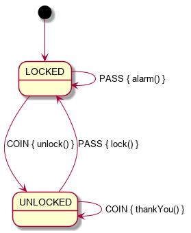
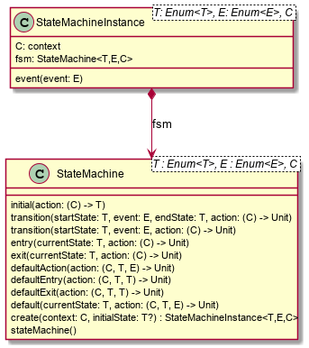
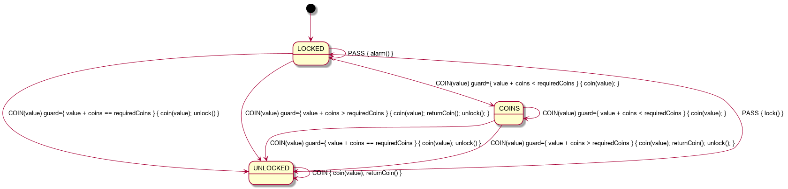

=== Simple turnstile example
Assume we and to manage the state on a simple lock.
We want to ensure that the `lock()` function is only called when the lock is not locked and we want `unlock()` to be called when locked.

Then we use the DSL to declare a definition of a statemachine matching the diagram:

==== State Diagram


==== State Table

|===
|Start State |Event |End State |Action

|LOCKED
|PASS
|LOCKED
|alarm

|LOCKED
|COIN
|UNLOCKED
|unlock

|UNLOCKED
|PASS
|LOCKED
|lock

|UNLOCKED
|COIN
|UNLOCKED
|returnCoin
|===

==== Context class
[source,kotlin]
----
class Turnstile(var locked: Boolean = true) {
    fun unlock() {
        assert(locked) { "Cannot unlock when not locked" }
        println("Unlock")
        locked = false
    }

    fun lock() {
        assert(!locked) { "Cannot lock when locked" }
        println("Lock")
        locked = true
    }

    fun alarm() {
        println("Alarm")
    }

    fun returnCoin() {
        println("Return coin")
    }
    override fun toString(): String {
        return "Turnstile(locked=$locked)"
    }
}
----

==== Enums for States and Events
We declare 2 enums, one for the possible states and one for the possible events.

[source,kotlin]
----
enum class TurnstileStates {
    LOCKED,
    UNLOCKED
}

enum class TurnstileEvents {
    COIN,
    PASS
}
----

==== Packaged definition and execution
[source,kotlin]
----
class TurnstileFSM(turnstile: Turnstile) {
    companion object {
        private val definition = stateMachine(TurnstileStates.values().toSet(), TurnstileEvents::class, Turnstile::class) {
            initial {
            if (locked)
                TurnstileStates.LOCKED
            else
                TurnstileStates.UNLOCKED
            }
            default {
                entry { startState, targetState, _ ->
                    println("entering:$startState -> $targetState for $this")
                }
                action { state, event, _ ->
                    println("Default action for state($state) -> event($event) for $this")
                    alarm()
                }
                exit { startState, targetState, _ ->
                    println("exiting:$startState -> $targetState for $this")
                }
            }
            state(TurnstileStates.LOCKED) {
                transition(TurnstileEvents.COIN to TurnstileStates.UNLOCKED) {
                    unlock()
                }
            }
            state(TurnstileStates.UNLOCKED) {
                transition(TurnstileEvents.COIN) {
                    returnCoin()
                }
                transition(TurnstileEvents.PASS to TurnstileStates.LOCKED) {
                    lock()
                }
            }
        }.build()
    }

    private val fsm = definition.create(turnstile)

    fun coin() = fsm.sendEvent(TurnstileEvents.COIN)
    fun pass() = fsm.sendEvent(TurnstileEvents.PASS)
}
----

With this We are saying:
When the state is `LOCKED` and on a `COIN` event then transition to `UNLOCKED` and execute the lambda which is treated
as a member of the context `{ unlock() }`

When the state is `LOCKED` and on `event(PASS)` we are perform the action `alarm()` without changing the end state.

==== Usage
Then we instantiate the FSM and provide a context to operate on:

[source,kotlin]
----
val turnstile = Turnstile()
val fsm = TurnstileFSM(turnstile)
----

Now we have a context that is independent of the FSM.

Sending events may invoke actions:
[source,kotlin]
----
// State state is LOCKED
fsm.coin()
// Expect unlock action end state is UNLOCKED
fsm.pass()
// Expect lock() action and end state is LOCKED
fsm.pass()
// Expect alarm() action and end state is LOCKED
fsm.coin()
// Expect unlock() and end state is UNLOCKED
fsm.coin()
// Expect returnCoin() and end state is UNLOCKED
----

link:https://github.com/open-jumpco/kfsm-samples[Samples]



=== Advanced Features
We can add arguments to events and use named state maps with push / pop and automatic transitions.

Arguments are sent as follows:
[source,kotlin]
----
fsm.sendEvent(EVENT1, arg1)
----

The argument is references in the action as follows:
[source,kotlin]
----
transition(EVENT1) { args ->
    val value = args[0] as Int
    // use value
}
----

If we update the turnstile to include the value of the coin in the coin event we could implement the following:
A named state where decisions regarding coins are made.
We push to `coins` with COINS state and then the automatic states will be triggered if the guards are met.



==== State Table

|===
|Start State |Event |Guard| End State | Action

|LOCKED
|PASS
|
|LOCKED
|alarm

|LOCKED
|COIN
|
|COINS
|coin(value)

|UNLOCKED
|PASS
|
|LOCKED
|lock

|COINS
|COIN
|
|COINS
|coin(value)

|COINS
|
|coins == requiredCoins
| UNLOCKED
| unlock

|COINS
|
|coins > requiredCoins
| UNLOCKED
| returnCoin(coins-requiredCoins), unlock

|===

When event is empty it is an automatic transition.
We will further place COINS state in a named state map to illustrate how these can be composes to isolate or group behaviour.

==== Context class

The context class doesn't make decisions.
The context class stores values and will update value in very specific ways.
[source,kotlin]
----
class PayingTurnstile(
    val requiredCoins: Int,
    locked: Boolean = true,
    coins: Int = 0
) {
    var coins: Int = coins
        private set
    var locked: Boolean = locked
        private set

    fun unlock() {
        require(locked) { "Cannot unlock when not locked" }
        require(coins >= requiredCoins) { "Not enough coins. ${requiredCoins - coins} required" }
        println("Unlock")
        locked = false
    }

    fun lock() {
        require(!locked) { "Cannot lock when locked" }
        require(coins == 0) { "Coins $coins must be returned" }
        println("Lock")
        locked = true
    }

    fun alarm() {
        println("Alarm")
    }

    fun coin(value: Int): Int {
        coins += value
        println("Value=$value, Total=$coins")
        return coins
    }

    fun returnCoin(returnCoins: Int) {
        println("Return Coin:$returnCoins")
        coins -= returnCoins
    }

    fun reset() {
        coins = 0
        println("Reset coins=$coins")
    }

    override fun toString(): String {
        return "Turnstile(locked=$locked,coins=$coins)"
    }

}
----
==== States and Events
[source,kotlin]
----
enum class PayingTurnstileStates {
    LOCKED,
    COINS,
    UNLOCKED
}

enum class PayingTurnstileEvents {
    COIN,
    PASS
}
----
We add a stateMap named `coins` with the state `COINS`.
The statemap  will be entered when there are coins.
The automatic transitions will be triggered based on the guard expressions.

==== State machine definition packaged
```kotlin
class PayingTurnstileFSM(turnstile: PayingTurnstile) {
    companion object {
        val definition = stateMachine(
            setOf(PayingTurnstileStates.LOCKED, PayingTurnstileStates.UNLOCKED),
            PayingTurnstileEvents::class,
            PayingTurnstile::class
        ) {
            initialMap {
                mutableListOf<StateMapItem<PayingTurnstileStates>>().apply {
                    if (locked) {
                        this.add(PayingTurnstileStates.LOCKED to "default")
                    } else {
                        this.add(PayingTurnstileStates.UNLOCKED to "default")
                    }
                    if (coins > 0) {
                        this.add(PayingTurnstileStates.COINS to "coins")
                    }
                }
            }
            default {
                entry { _, targetState, args ->
                    if (args.isNotEmpty()) {
                        println("entering:$targetState (${args.toList()}) for $this")
                    } else {
                        println("entering:$targetState for $this")
                    }
                }
                action { state, event, args ->
                    if (args.isNotEmpty()) {
                        println("Default action for state($state) -> on($event, ${args.toList()}) for $this")
                    } else {
                        println("Default action for state($state) -> on($event) for $this")
                    }
                    alarm()
                }
                exit { startState, _, args ->
                    if (args.isNotEmpty()) {
                        println("exiting:$startState (${args.toList()}) for $this")
                    } else {
                        println("exiting:$startState for $this")
                    }
                }
            }
            stateMap("coins", setOf(PayingTurnstileStates.COINS)) {
                state(PayingTurnstileStates.COINS) {
                    automaticPop(PayingTurnstileStates.UNLOCKED, guard = { coins > requiredCoins }) {
                        println("automaticPop:returnCoin")
                        returnCoin(coins - requiredCoins)
                        unlock()
                        reset()
                    }
                    automaticPop(PayingTurnstileStates.UNLOCKED, guard = { coins == requiredCoins }) {
                        println("automaticPop")
                        unlock()
                        reset()
                    }
                    transition(PayingTurnstileEvents.COIN) { args ->
                        val value = args[0] as Int
                        coin(value)
                        println("Coins=$coins")
                        if (coins < requiredCoins) {
                            println("Please add ${requiredCoins - coins}")
                        }
                    }
                }
            }
            state(PayingTurnstileStates.LOCKED) {
                // The coin brings amount to exact amount
                pushTransition(PayingTurnstileEvents.COIN, "coins", PayingTurnstileStates.COINS) { args ->
                    val value = args[0] as Int
                    coin(value)
                    unlock()
                    reset()
                }
                // The coins add up to more than required
                pushTransition(PayingTurnstileEvents.COIN, "coins", PayingTurnstileStates.COINS,
                    guard = { args ->
                        val value = args[0] as Int;
                        value + this.coins < this.requiredCoins
                    }) { args ->
                    val value = args[0] as Int
                    println("PUSH TRANSITION")
                    coin(value)
                    println("Coins=$coins, Please add ${requiredCoins - coins}")
                }
            }
            state(PayingTurnstileStates.UNLOCKED) {
                transition(PayingTurnstileEvents.COIN) { args ->
                    val value = args[0] as Int
                    returnCoin(coin(value))
                }
                transition(PayingTurnstileEvents.PASS to PayingTurnstileStates.LOCKED) {
                    lock()
                }
            }
        }.build()
    }

    val fsm = definition.create(turnstile)

    fun coin(value: Int) {
        println("sendEvent:COIN:$value")
        fsm.sendEvent(PayingTurnstileEvents.COIN, value)
    }

    fun pass() {
        println("sendEvent:PASS")
        fsm.sendEvent(PayingTurnstileEvents.PASS)
    }

    fun allowedEvents() = fsm.allowed().map { it.name.toLowerCase() }.toSet()

}
```

==== Test
```kotlin
val turnstile = PayingTurnstile(50)
val fsm = PayingTurnstileFSM(turnstile)
assertTrue(turnstile.locked)
println("--coin1")
fsm.coin(10)
assertTrue(turnstile.locked)
assertTrue(turnstile.coins == 10)
assertTrue(
    fsm.fsm.currentStateMap.name != null && "coins" == fsm.fsm.currentStateMap.name,
    "Expected coins map"
)
println("--coin2")
fsm.coin(60)
assertTrue(turnstile.coins == 0)
assertTrue(fsm.fsm.currentStateMap.name == null, "Expected default map")
assertTrue(!turnstile.locked)
println("--pass1")
fsm.pass()
assertTrue(turnstile.locked)
println("--pass2")
fsm.pass()
println("--pass3")
fsm.pass()
println("--coin3")
fsm.coin(40)
assertTrue(turnstile.coins == 40)
println("--coin4")
fsm.coin(10)
assertTrue(turnstile.coins == 0)
assertTrue(!turnstile.locked)
```

==== Output
```
--coin1
sendEvent:COIN:10
entering:LOCKED ([10]) for Turnstile(locked=true,coins=0)
PUSH TRANSITION
Coin received=10, Total=10
Coins=10, Please add 40
--coin2
sendEvent:COIN:60
Coin received=60, Total=70
Return Coin:20
Unlock
Reset coins=0
entering:UNLOCKED ([60]) for Turnstile(locked=false,coins=0)
--pass1
sendEvent:PASS
exiting:UNLOCKED for Turnstile(locked=false,coins=0)
Lock
entering:LOCKED for Turnstile(locked=true,coins=0)
--pass2
sendEvent:PASS
Default action for state(LOCKED) -> on(PASS) for Turnstile(locked=true,coins=0)
Alarm
--pass3
sendEvent:PASS
Default action for state(LOCKED) -> on(PASS) for Turnstile(locked=true,coins=0)
Alarm
--coin3
sendEvent:COIN:40
entering:LOCKED ([40]) for Turnstile(locked=true,coins=0)
PUSH TRANSITION
Coin received=40, Total=40
Coins=40, Please add 10
--coin4
sendEvent:COIN:10
Coin received=10, Total=50
Unlock
Reset coins=0
entering:UNLOCKED ([10]) for Turnstile(locked=false,coins=0)
```
