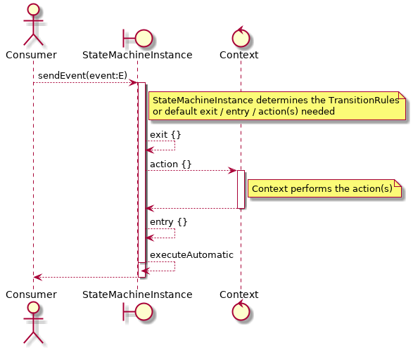

== Getting Started

=== Repository

Use this repository for SNAPSHOT builds. Releases are on Maven Central
[source,groovy]
----
repositories {
    maven {
        url 'https://oss.sonatype.org/content/groups/public'
    }
}
----
=== Dependencies
==== Kotlin/JVM Projects

===== Gradle Groovy DSL
[source,groovy]
----
dependencies {
    implementation 'io.jumpco.open:kfsm-jvm:1.5.1'
}
----

===== Gradle Kotlin DSL
[source,kotlin]
----
dependencies {
    implementation("io.jumpco.open:kfsm-jvm:1.5.1")
}
----

==== KotlinJS Projects
===== Gradle Groovy DSL
[source,groovy]
----
dependencies {
    implementation 'io.jumpco.open:kfsm-js:1.5.1'
}
----
===== Gradle Kotlin DSL
[source,kotlin]
----
dependencies {
    implementation("io.jumpco.open:kfsm-js:1.5.1")
}
----

==== Kotlin/Native Projects using LinuxX64
===== Gradle Groovy DSL
[source,groovy]
----
dependencies {
    implementation 'io.jumpco.open:kfsm-linuxX64:1.5.1'
}
----
===== Gradle Kotlin DSL
[source,kotlin]
----
dependencies {
    implementation("io.jumpco.open:kfsm-linuxX64:1.5.1")
}
----

==== Kotlin/Native Projects using MinGW64
===== Gradle Groovy DSL
[source,groovy]
----
dependencies {
    implementation 'io.jumpco.open:kfsm-mingwX64:1.5.1'
}
----
===== Gradle Kotlin DSL
[source,kotlin]
----
dependencies {
    implementation("io.jumpco.open:kfsm-mingwX64:1.5.1")
}
----

==== Kotlin/Native Projects using macOS
===== Gradle Groovy DSL
[source,groovy]
----
dependencies {
    implementation 'io.jumpco.open:kfsm-macosX64:1.5.1'
}
----
===== Gradle Kotlin DSL
[source,kotlin]
----
dependencies {
    implementation("io.jumpco.open:kfsm-macosX64:1.5.1")
}
----

== Finite state machines.

This section will describe the life-cycle and philosophy behind this implementation of Finite state machines.

=== Definition
An FSM is defined using a DSL as described further in this document.

During this definition the user describes state types, events types as well as the behaviour of the FSM to events and how it will operate on a provided context.

The state and event types should be a value types.

The names `START` and `END` as states will be used the the start and end states when a state diagram is generated by `kfsm-viz`

The events may receive an argument and may return a value. The argument for all event must be the same type. However sealed classes can be used to simplify the representation of different argument types.

The state machine will define one or more state maps each representing a subset of possible states of the same type.

The state machine will receive events, constrained by set of events. The events does not have to be enum, only a value with `equals` and `hashCode` implementations.

The state machine will apply actions to a context. The context represents the work that need to be performed.

An event may trigger a state transition which defines actions to apply when the state machine is in a specific state.

Transitions may have a guard expression that has to evaluate to `true` to allow execution of transition.

An automatic transition can be defined on a state and has no events. Automatic transitions will be executed if the specific state is current after the exit action.

A timeout transition can be defined on a state and is triggered a configured amount of time after the entry into the state. The transition will be trigger upon timeout unless a configured guard expression doesn't evaluate to `true`.

The state can be any value type providing `equals` and `hashCode`, even though we have been using `enum class` most examples.

=== Instance
The philosophy behind the design is that the finite state machine can be used when needed by creating an instance using the definition and providing it with the context and optionally a previously externalized state.
The state machine can also be defined to derive the current state from the provided context.

Then events are sent to the FSM with an argument if needed and this may trigger the defined actions.

The FSM provides for a query to determine which events are allowed for the current or a given state. This is useful when user interaction controls need to be disabled or in the case of a back-end application using HATEOAS can add links limited to allowed events.

If the FSM is configured with timeout transitions the instance will need to remain active. This is typically only used in UI or embedded interactive applications.

If the FSM is used in a stateless environment that is driven by requests or events, the state can be externalised after use if it isn't derived from the provided context.
The externalised state is a list of pairs making up the state type and the name of the associated statemap.

=== Named Maps and Push / Pop Transitions

A named map represents a set of states that is grouped together. Named maps can be visited by using a push transition and return using a pop transition.
A push transition requires a map name and a target state along with the normal event and optional guard and action.
The current state map will be pushed on a stack and a statemap instance will be created using the named definition.
Events will be processed according to the transition rules of the named map.

== DSL
The DSL provides a way of configuring the statemachine.
The statemachine supports:

* Transitions: internal and external
** Transitions are external when the target state is defined even if the target is same as current.
* Guard expressions
* Entry and exit actions per state and globally
* Default actions per state and globally
* Named statemaps
* Push and pop transitions
* Automatic transitions
* Timeout transitions
* Actions as `suspend` functions.
* State machine `invariant` will be evaluated on all events and throw an `InvariantException` if not true

All configuration calls are eventually applied to link:javadoc/kfsm/io.jumpco.open.kfsm/-state-machine-builder/index.html[StateMachineBuilder]

=== `stateMachine`
The top level element is `stateMachine` either by using the function

* link:javadoc/kfsm/io.jumpco.open.kfsm/-state-machine-builder/state-machine.html[StateMachineBuilder::stateMachine]
* link:javadoc/kfsm/io.jumpco.open.kfsm/state-machine.html[stateMachine]

There are 3 overloaded variations on `stateMachine` for providing `Any` as the return type and the argument to events/actions in cases where they are not used.
[source,kotlin,numbered]
----
// using global function
val definition = stateMachine(
    State.values().toSet(),
    Event.values().toSet(),
    ContextType::class,
    ArgType::class,
    ReturnType::class
) {
    defaultInitialState = State.S1 // optional start state
    invariant { } // invariant for stateMachine
    default { // global defaults
    }
    initialState { // initial state expression
    }
    initialStates { // define expression for deriving state stack for nested maps.
    }
    onStateChange { // define an event handler to be invoked after a transition when the state has changed.

    }
    stateMap { // define named statemap
    }
    whenState { // state definition
    }
}.build()
----

=== `functionalStateMachine`
The top level element is `functionalStateMachine` either by using the function

* link:javadoc/kfsm/io.jumpco.open.kfsm/functional-state-machine.html[functionalStateMachine]

It provides the same as `stateMachine` but in this case the Context, argument and return types are all the same.
[source,kotlin,numbered]
----
// using global function
val definition = stateMachine(
    State.values().toSet(),
    Event.values().toSet(),
    ContextType::class
) {
    defaultInitialState = State.S1 // optional start state
    invariant { } // invariant for stateMachine
    default { // global defaults
    }
    initialState { // initial state expression
    }
    initialStates { // define expression for deriving state stack for nested maps.
    }
    onStateChange { // define an event handler to be invoked after a transition when the state has changed.

    }
    stateMap { // define named statemap
    }
    whenState { // state definition
    }
}.build()
----

=== `asyncStateMachine`

This method provides for creating a statemachine definition and instances that have `suspend` functions as actions.
This also adds the support for `timeout` on the state map handler.

* link:javadoc/kfsm/io.jumpco.open.kfsm.async/async-state-machine.html[asyncStateMachine]
* link:javadoc/kfsm/io.jumpco.open.kfsm.async/-async-state-machine-builder/state-machine.html

There are 3 overloaded variations on `stateMachine` for providing `Any` as the return type and the argument to events/actions in cases where they are not used.
[source,kotlin,numbered]
----
// using global function
val definition = asyncStateMachine(
    State.values().toSet(),
    Event.values().toSet(),
    ContextType::class,
    ArgType::class,
    ReturnType::class
) {
    defaultInitialState = State.S1 // optional
    invariant { } // invariant for stateMachine
    default { // global defaults
    }
    initialState { // initial state expression
    }
    initialStates { // define expression for deriving state stack for nested maps.
    }
    onStateChange { // define an event handler to be invoked after a transition when the state has changed.

    }
    stateMap { // define named statemap
    }
    whenState { // state definition
    }
}.build()
----

=== `asyncFunctionalStateMachine`

This is the same as `asyncStateMachine` except that Context, argument and return types are all the same.

* link:javadoc/kfsm/io.jumpco.open.kfsm.async/async-functional-state-machine.html[asyncFunctionalStateMachine]

[source,kotlin,numbered]
----
// using global function
val definition = asyncFunctionalStateMachine(
    State.values().toSet(),
    Event.values().toSet(),
    ContextType::class
) {
    defaultInitialState = State.S1 // optional
    invariant { } // invariant for stateMachine
    default { // global defaults
    }
    initialState { // initial state expression
    }
    initialStates { // define expression for deriving state stack for nested maps.
    }
    onStateChange { // define an event handler to be invoked after a transition when the state has changed.

    }
    stateMap { // define named statemap
    }
    whenState { // state definition
    }
}.build()
----

=== `default`
* Handler: link:javadoc/kfsm/io.jumpco.open.kfsm/-dsl-state-machine-handler/default.html[DslStateMachineHandler::default]
* Mandatory: _Optional_
* Cardinality: _Multiple_

Provide default configuration for entry and exit actions as well as a default action.

Example:
[source,kotlin,numbered]
----
default {
    action { // global action
    }
    onEntry { // global state entry action
    }
    onExit { // global state exit action
    }
    onEvent { // default transitions
    }
}
----

==== `action`
* Handler: link:javadoc/kfsm/io.jumpco.open.kfsm/-dsl-state-map-default-event-handler/action.html[DslStateMachineDefaultEventHandler::action]
* Mandatory: _Optional_
* Cardinality: _Single_

Provide a lambda `C.(S, E, A?)->R?` that will be invoked when no other transitions are matched.

Example:
[source,kotlin,numbered]
----
action { currentState, event, arg -> // global default action
    contextFunction()
    anotherContextFunction()
}
----

==== `onEntry`
* Handler: link:javadoc/kfsm/io.jumpco.open.kfsm/-dsl-state-map-default-event-handler/on-entry.html[DslStateMachineDefaultEventHandler::onEntry]
* Mandatory: _Optional_
* Cardinality: _Single_

Provide a lambda `C.(S,S,A?) -> Unit` that will be invoked before a change in the state of the FSM.
Global entry actions will be called for all external transitions after state specific entry actions.

Example:
[source,kotlin,numbered]
----
onEntry { fromState, targetState, arg ->
    entryAction()
}
----

==== `onExit`
* Handler: link:javadoc/kfsm/io.jumpco.open.kfsm/-dsl-state-map-default-event-handler/on-exit.html[DslStateMachineDefaultEventHandler::onExit]
* Mandatory: _Optional_
* Cardinality: _Single_

Provide a lambda `C.(S,S,A?) -> Unit` that will be invoked after a change in the state of the FSM.
Global exit actions will be called for all external transitions after state specific entry actions.

Example:
[source,kotlin,numbered]
----
onExit { fromState, targetState, arg ->
    exitAction()
}
----
==== `onEvent`
* Arguments: `(event: E [to targetState: S])`
* Handler: link:javadoc/kfsm/io.jumpco.open.kfsm/-dsl-state-map-default-event-handler/on-event.html[DslStateMachineDefaultEventHandler::onEvent]
* Mandatory: _Optional_
* Cardinality: _Multiple_

This defines a transition when a specific event is receive and no other transition was matched.
There are 2 variations, the first is internal and doesn't define a target state, the second is external and defines a target state.
In both cases the lambda type is `C.(A?) -> R?`

Example:
[source,kotlin,numbered]
----
onEvent(Event.EVENT) { arg -> // default internal state action for given event
    someFunction()
}

onEvent(Event.EVENT to State.STATE) { arg -> // default external state action for given event
    anotherFunction()
}
----

=== `initialState`
* Handler: link:javadoc/kfsm/io.jumpco.open.kfsm/-dsl-state-machine-handler/initial-state.html[DslStateMachineHandler::initialState]
* Mandatory: _Optional_
* Cardinality: _Single_

Provide a lambda `C.() -> S` that will determine the state of the state machine.

Example:
[source,kotlin,numbered]
----
initialState {
    when(flag) {
        1 -> State.S1
        2 -> State.S2
        else -> error("Invalid state")
    }
}
----
=== `initialStates`
* Handler: link:javadoc/kfsm/io.jumpco.open.kfsm/-dsl-state-machine-handler/initial-states.html[DslStateMachineHandler::initialStates]
* Mandatory: _Optional_
* Cardinality: _Single_

One of `initialState` or `initialStates` must be provided.
When a state-machine has named maps the `initialStates` must be provided.

Provide a lambda `C.() -> StateMapList<S>` that will determine the state of the state machine and map names that should be placed on the stack.

Example:
[source,kotlin,numbered]
----
initialStates {
    mutableListOf<StateMapItem<PayingTurnstileStates>>().apply {
        if (locked) {
            this.add(PayingTurnstileStates.LOCKED to "default")
        } else {
            this.add(PayingTurnstileStates.UNLOCKED to "default")
        }
        if (coins > 0) {
            this.add(PayingTurnstileStates.COINS to "coins")
        }
    }.toMap()
}
----
=== `onStateChange`
* Handler: link:javadoc/kfsm/io.jumpco.open.kfsm/-dsl-state-machine-handler/on-state-change.html[DslStateMachineHandler::onStateChange]
* Mandatory: _Optional_
* Cardinality: _Single_

The `onStateChange` handler will be invoked after a transition has complete and the new state has taken effect. onExit and onEntry are invoked before a state change and checking allow within those handlers still relfect the previous state.

=== `whenState`
* Arguments: `(currentState: S)`
* Handler: link:javadoc/kfsm/io.jumpco.open.kfsm/-dsl-state-machine-handler/when-state.html[DslStateMachineHandler::whenState]
* Mandatory: _Mandatory_
* Cardinality: _Multiple_

Each `whenState` block decribes the transitions for a given state.

Example:
[source,kotlin,numbered]
----
whenState(State.STATE) {
    default { // default action for State.STATE
    }
    onEntry { // entry action for State.STATE
    }
    onExit { // exit action for State.STATE
    }
    onEvent(Event.EV2 to State.S1, guard = {flag == 1 }) { // external transition with guard expression
    }
    onEventPush(Event.EV2, "mapName", State.S1, gaurd = { flag == 1}) { // push transition to new map with guard expression
    }
    onEventPop(Event.EV3, "newMap", State.S3) { // pop transition leading into new push transition while executing current action only
    }
    automatic(State.S1, guard = { flag == 1}) { // automatic transition to new state when guard is met
    }
    // timeout is limited to AsyncStateMachineBuilder
    timeout(State.S1, timeout, [guard = { expression }]) { // transition to S1 when timeout is triggered and guard is true
    }
    timeoutPop(State.S1, timeout, [guard = { expression }]) { // transition to S1 when timeout is triggered and guard is true
    }
    timeoutPush(State.S1, "mapName",  timeout, [guard = { expression }]) { // transition to S1 when timeout is triggered and guard is true
    }
}
----

==== `default`
* Handler: link:javadoc/kfsm/io.jumpco.open.kfsm/-dsl-state-map-event-handler/default.html[DslStateMachineEventHandler::default]
* Mandatory: _Optional_
* Cardinality: _Single_

A state block may have one default action which is a lambda of type `C.(S,E,Array<out Any>) -> Unit` that is invoked when no other transition is found for the given state and event and guard expressions.

Example:
[source,kotlin,numbered]
----
default { fromState, event, arg -> // default state action
    someDefaultAction()
}
----

==== `onEntry`
* Handler: link:javadoc/kfsm/io.jumpco.open.kfsm/-dsl-state-map-event-handler/on-entry.html[DslStateMachineEventHandler::onEntry]
* Mandatory: _Optional_
* Cardinality: _Single_

This defines a lambda of type `C.(S,S,A?) -> R?` that will be invoked after the transition action for an external transition.

Example:
[source,kotlin,numbered]
----

onEntry { fromState, targetState, arg -> // state entry action
    println("Entering:$targetState from $fromState with $arg")
}
----
==== `onExit`
* Handler: link:javadoc/kfsm/io.jumpco.open.kfsm/-dsl-state-map-event-handler/on-exit.html[DslStateMachineEventHandler::onExit]
* Mandatory: _Optional_
* Cardinality: _Single_

This defines a lambda of type `C.(S,S,A?) -> Unit` that will be invoked before the transition action for an external transitions.

Example:
[source,kotlin,numbered]
----
onExit { fromState, targetState, arg -> // state exit action
    println("Exiting:$fromState to $targetState with $arg")
}
----
==== `automatic`
* Arguments: `(targetState: S [, guard:{}])`
* Handler: link:javadoc/kfsm/io.jumpco.open.kfsm/-dsl-state-map-event-handler/automatic.html[DslStateMachineDefaultEventHandler::automatic]
* Mandatory: _Optional_
* Cardinality: _Multiple_

There are 2 variations of automatic transitions: Those with and without guards.
An automatic transition is exercises after the state machine has completed processing a transition.
All automatic transitions attached to a given state will be invoked if their guards are met.

Example:
[source,kotlin,numbered]
----
whenState(State.S1) {
    automatic(State.S1, guard = { flag == 1}) { // automatic transition to new state when guard is met
    }
    automatic(State.S1) { // automatic transition to new state
    }
}
----

==== `automaticPop`
* Arguments: `([targetMap: String,][,targetState: S] [, guard:{}])`
* Handler: link:javadoc/kfsm/io.jumpco.open.kfsm/-dsl-state-map-event-handler/automatic-pop.html[DslStateMachineDefaultEventHandler::automaticPop]
* Mandatory: _Optional_
* Cardinality: _Multiple_

There are 6 variations of automatic transitions: Those with and without guards, those with and without targetMaps which will lead to a new push transition.

Example:
[source,kotlin,numbered]
----
whenState(State.S1) {
    automaticPop { // pop when S1
    }
    automaticPop(guard= { flag == 1 }) { // pop when S1 and guard is true
    }
    automaticPop(State.S2, guard = { flag == 1 }) { // automatic pop transition to new state when guard is met
    }
    automaticPop(State.S2) { // automatic pop transition to new state
    }
    automaticPop("map1", State.S2) { // automatic pop transition to push transition to new state in target map
    }
    automaticPop("map1", State.S2, guard={flag == 1 }) { // automatic pop transition to push transition to new state in target map
    }
}
----

==== `automaticPush`
* Arguments: `(targetMap: String, targetState: S [, guard:{}])`
* Handler: link:javadoc/kfsm/io.jumpco.open.kfsm/-dsl-state-map-event-handler/automatic-push.html[DslStateMachineDefaultEventHandler::automaticPush]
* Mandatory: _Optional_
* Cardinality: _Multiple_

There are 2 variations of automatic transitions: Those with and without guards

Example:
[source,kotlin,numbered]
----
whenState(State.S1) {
    automaticPush("map1", State.S2) { // automatic push transition to S2 in target map "map1"
    }
    automaticPush("map1", State.S2, guard={flag == 1 }) { // automatic push transition to S2 in target map "map1" if guard is true
    }
}
----
==== `onEvent`
* Arguments: `(event: E [to targetState: S],[guard: {}])`
* Handler: link:javadoc/kfsm/io.jumpco.open.kfsm/-dsl-state-map-event-handler/on-event.html[DslStateMachineEventHandler::onEvent]
* Mandatory: _Optional_
* Cardinality: _Multiple_

There are 4 variations of transitions: External and internal, with and without a guard expression.

This defines a transition action for a given event.
For an external transition a target state must be provided, while an internal transition must have no targetState.
An optional guard expression can be provided. The order in which the DSL encounters guard expression determine the evaluation order.
The first matching guard expression will determine the transition that will be used.
Their may be only one transition without a guard expression.

Examples:
[source,kotlin,numbered]
----
onEvent(Event.EV1, guard = { flag == 1 }) { arg -> // internal transition with guard expression
}
onEvent(Event.EV1 to State.S2, guard = { flag == 2}) { arg -> // external transition with guard expression
}
onEvent(Event.EV1) { arg -> // internal transition
}
onEvent(Event.EV2 to State.S2) { arg -> // external transition
}
----
==== `onEventPush`
* Arguments: `(event: E, targetMap: String, targetState: S [, guard:{}])`
* Handler: link:javadoc/kfsm/io.jumpco.open.kfsm/-dsl-state-map-event-handler/on-event-push.html[DslStateMachineEventHandler::onEventPush]
* Mandatory: _Optional_
* Cardinality: _Multiple_

There are 2 variations of automatic transitions: Those with and without guards
Example:
[source,kotlin,numbered]
----
whenState(State.S1) {
    onEventPush(Event.EV2, "mapName", State.S2) { // push transition to S2 in new map "mapName"
    }
    onEventPush(Event.EV2, "mapName", State.S2, gaurd = { flag == 1}) { // push transition to S2 in new map "mapName" with guard expression
    }
}
----
==== `onEventPop`
* Arguments: `(event: E [to targetState: S]|[,targetMap: String, targetState: S], [guard:{}])`
* Handler: link:javadoc/kfsm/io.jumpco.open.kfsm/-dsl-state-map-event-handler/on-event-pop.html[DslStateMachineEventHandler::onEventPop]
* Mandatory: _Optional_
* Cardinality: _Multiple_

There are 6 variations of popTransitions to provide for with and without guards, with and without a new state and with and without a targetMap that will result in a new push transition.

Example:
[source,kotlin,numbered]
----
whenState(State.S1) {
    onEventPop(Event.EV3) { // pop transition without targetState
    }
    onEventPop(Event.EV3, guard={ flag == 1 }) { // pop transition without targetState and guard expression
    }
    onEventPop(Event.EV3 to State.S2) { // pop transition on EV3 changing state to S2
    }
    onEventPop(Event.EV3 to State.S2, guard={ flag == 1 }) { // pop transition on EV3 changing state to S2 with a guard expression
    }
    onEventPop(Event.EV3, "newMap", State.S3) { // pop transition leading into new push transition to S3 in "newMap"
    }
    onEventPop(Event.EV3, "newMap", State.S3, guard={ flag == 1 }) { // pop transition leading into new push transition to S3 in "newMap" with a guard expression
    }
}
----

==== `timeout`
* Arguments: `(targetState: S, timeout: Long, [guard:{}])`
* Handler: link:javadoc/kfsm/io.jumpco.open.kfsm.async/-async-dsl-state-map-event-handler/timeout.html[AsyncDslStateMapEventHandler::onEventPop]
* Mandatory: _Optional_
* Cardinality: _Multiple_

There are 2 versions. One adds the support for a guard expression that will be evaluated and the action will only trigger if the guard evaluates true.

==== `timeoutPop`
* Arguments: `([targetMap: String], targetState: S, timeout: Long, [guard:{}])`
* Handler: link:javadoc/kfsm/io.jumpco.open.kfsm.async/-async-dsl-state-map-event-handler/timeout-pop.html[AsyncDslStateMapEventHandler::timeoutPop]
* Mandatory: _Optional_
* Cardinality: _Multiple_

There are 5 versions.
Combinations exist to add the optional guard expression and the targetMap.

==== `timeoutPush`
* Arguments: `(targetMap: String, targetState: S, timeout: Long, [guard:{}])`
* Handler: link:javadoc/kfsm/io.jumpco.open.kfsm.async/-async-dsl-state-map-event-handler/timeout-push.html[AsyncDslStateMapEventHandler::timeoutPush]
* Mandatory: _Optional_
* Cardinality: _Multiple_

There are 2 variations, the 2nd adds the optional guard expression.

== Operation

When the FSM was defined and instance can be created providing a context and optional externalized stated.

When sendEvent is called the state machine applies the event to the current state map.
The current state map is usually top-level state map unless you have defined named maps and used a push transition.

=== Send Event
The normal operation is to invoke the following actions:

* `sendEvent`
** `if(external) exitAction()`
** `action()`
** `if(external) entryAction()`

The exit action is chosen from one of:

* `stateMap/whenState/onExit`
* `stateMap/whenState/default/onExit`
* `stateMap/default/onExit`

The action is chosen from one of:

* `stateMap/whenState/onEvent`
* `stateMap/whenState/default/action`
* `stateMap/default/action`

The entry action is chosen from one of:

* `stateMap/whenState/onEntry`
* `stateMap/whenState/default/onEntry`
* `stateMap/default/onEntry`

The combination of current state and event determines a set of transition rules that have been applied to that combination by one or more definitions.
If the transition rules contains guard transitions the guard expressions are evaluated until one evaluates `true`.
The `onEntry` and `onExit` action are only invoked for `external` transitions.

External transitions have an explicit target state defined. If the target state is not defined it is an internal transition.

The currentState determines the exit action. The target state determines the entry action.

=== Notes on concurrency and coroutines.
The implementations of the AsyncTimer on the different platform work slightly differently depending on the platform.

==== JVM
The code in the JVM implementation uses `CoroutineScope(Dispatchers.Default)` to `launch` the trigger. Your action will be responsible for ensuring proper handling if a UI thread is impacted.

==== JavaScript
The current code assumes you are executing in the browser it uses `window.setTimeout to configure a function that will use `GlobalScope` to `launch` the trigger.

