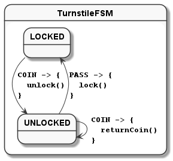
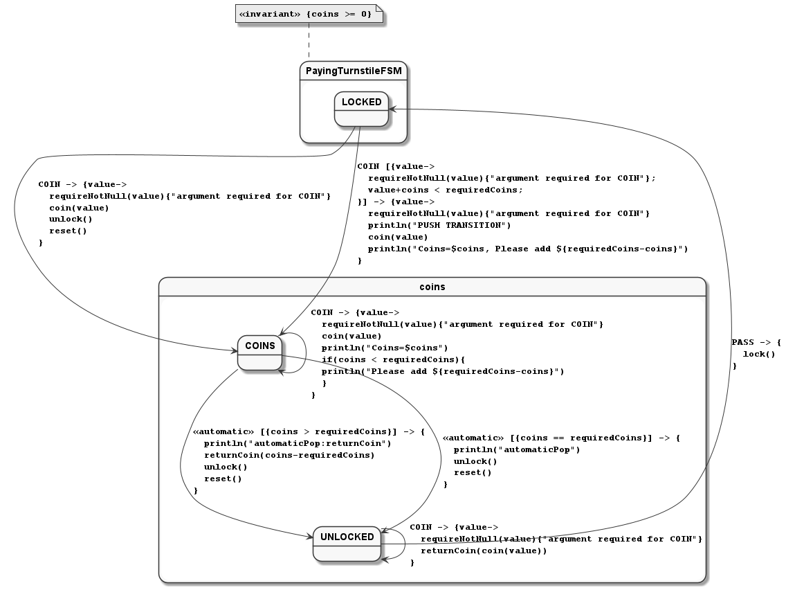
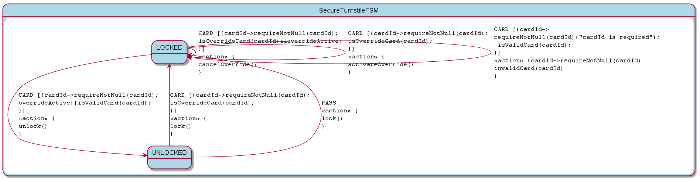
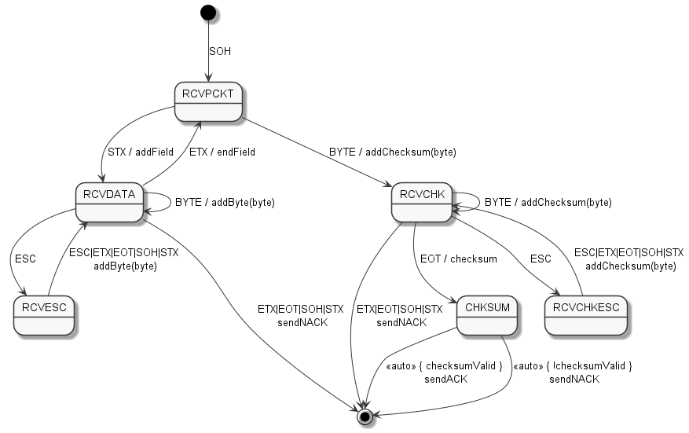
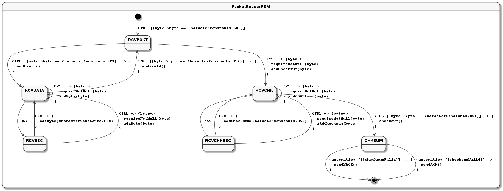
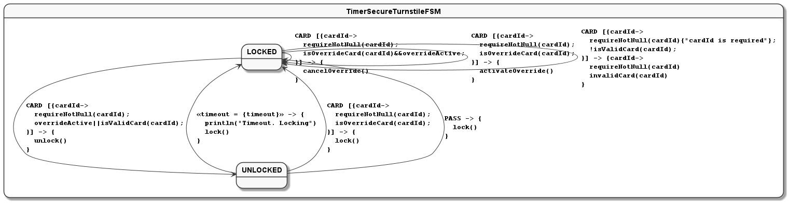

=== Simple turnstile example

Assume we and to manage the state on a simple lock.
We want to ensure that the `lock()` function is only called when the lock is not locked and we want `unlock()` to be called when locked.

Then we use the DSL to declare a definition of a statemachine matching the diagram:

==== State Diagram



==== State Table

|===
|Start State |Event |End State |Action

|LOCKED
|PASS
|LOCKED
|alarm

|LOCKED
|COIN
|UNLOCKED
|unlock

|UNLOCKED
|PASS
|LOCKED
|lock

|UNLOCKED
|COIN
|UNLOCKED
|returnCoin
|===

==== Context class

[source,kotlin,numbered]
----
include::../../commonTest/kotlin/io/jumpco/open/kfsm/example/TurnstileTypes.kt[tag=context]
----

==== Enums for States and Events

We declare 2 enums, one for the possible states and one for the possible events.

[source,kotlin,numbered]
----
include::../../commonTest/kotlin/io/jumpco/open/kfsm/example/TurnstileTypes.kt[tag=states-events]
----

==== Packaged definition and execution

[source,kotlin,numbered]
----
include::../../commonTest/kotlin/io/jumpco/open/kfsm/example/TurnstileTypes.kt[tag=packaged]
----

==== Usage

Then we instantiate the FSM and provide a context to operate on:

[source,kotlin,numbered]
----
val turnstile = Turnstile()
val fsm = TurnstileFSM(turnstile)
----

Now we have a context that is independent of the FSM.

Sending events may invoke actions:

[source,kotlin,numbered]
----
// State state is LOCKED
fsm.coin()
// Expect unlock action end state is UNLOCKED
fsm.pass()
// Expect lock() action and end state is LOCKED
fsm.pass()
// Expect alarm() action and end state is LOCKED
fsm.coin()
// Expect unlock() and end state is UNLOCKED
fsm.coin()
// Expect returnCoin() and end state is UNLOCKED
----

link:https://github.com/open-jumpco/kfsm-samples[Samples]

=== Advanced Features

We can add an argument to events and use named state maps with push / pop and automatic transitions.

The argument is sent as follows:

[source,kotlin,numbered]
----
fsm.sendEvent(EVENT1, arg)
----

The argument is references in the action as follows:

[source,kotlin,numbered]
----
onEvent(EVENT1) { arg ->
    val value = arg as Int
}
----

If we update the turnstile to include the value of the coin in the coin event we could implement the following:
A named state where decisions regarding coins are made.
We push to `coins` with COINS state and then the automatic states will be triggered if the guards are met.



==== State Table

|===
|Start State |Event |Guard Expression | End State | Action

|LOCKED
|PASS
|
|LOCKED
|alarm

|LOCKED
|COIN
|
|COINS
|coin(value)

|UNLOCKED
|PASS
|
|LOCKED
|lock

|COINS
|COIN
|
|COINS
|coin(value)

|COINS
|
|coins == requiredCoins
| UNLOCKED
| unlock

|COINS
|
|coins > requiredCoins
| UNLOCKED
| returnCoin(coins-requiredCoins), unlock

|===

When event is empty it is an automatic transition.
We will further place COINS state in a named state map to illustrate how these can be composes to isolate or group behaviour.

==== Context class

The context class doesn't make decisions.
The context class stores values and will update value in very specific ways.

[source,kotlin,numbered]
----
include::../../commonTest/kotlin/io/jumpco/open/kfsm/example/PayingTurnstileTypes.kt[tag=context]
----

==== States and Events

[source,kotlin,numbered]
----
include::../../commonTest/kotlin/io/jumpco/open/kfsm/example/PayingTurnstileTypes.kt[tag=states-events]
----

We add a stateMap named `coins` with the state `COINS`.
The statemap will be entered when there are coins.
The automatic transitions will be triggered based on the guard expressions.

==== State machine definition packaged

This includes an example of externalizing the state and creating an instance using a previously externalized state.
The `externalState` method provides a list of states for the case where there are nested statemaps.

[source,kotlin,numbered]
----
include::../../commonTest/kotlin/io/jumpco/open/kfsm/example/PayingTurnstileTypes.kt[tag=packaged]
----

==== Test

[source,kotlin,numbered]
----
include::../../jvmTest/kotlin/io/jumpco/open/kfsm/example/PayingTurnstileFsmTests.kt[tag=test]
----

==== Output

```
--coin1
sendEvent:COIN:10
entering:LOCKED ([10]) for Turnstile(locked=true,coins=0)
PUSH TRANSITION
Coin received=10, Total=10
Coins=10, Please add 40
--coin2
sendEvent:COIN:60
Coin received=60, Total=70
Return Coin:20
Unlock
Reset coins=0
entering:UNLOCKED ([60]) for Turnstile(locked=false,coins=0)
--pass1
sendEvent:PASS
exiting:UNLOCKED for Turnstile(locked=false,coins=0)
Lock
entering:LOCKED for Turnstile(locked=true,coins=0)
--pass2
sendEvent:PASS
Default action for state(LOCKED) -> on(PASS) for Turnstile(locked=true,coins=0)
Alarm
--pass3
sendEvent:PASS
Default action for state(LOCKED) -> on(PASS) for Turnstile(locked=true,coins=0)
Alarm
--coin3
sendEvent:COIN:40
entering:LOCKED ([40]) for Turnstile(locked=true,coins=0)
PUSH TRANSITION
Coin received=40, Total=40
Coins=40, Please add 10
--coin4
sendEvent:COIN:10
Coin received=10, Total=50
Unlock
Reset coins=0
entering:UNLOCKED ([10]) for Turnstile(locked=false,coins=0)
```

=== Secure Turnstile Example

Unless you grew up in a city with a subway you may not be familiar with a turnstile accepting counts.
You may be familiar with turnstile that responds to RFID or NFC cards.

We would add a complexity that allows for an override card to allow cards to pass even if they are invalid.

We will use guard expressions to identify the override card and the validity of the card.
When the override card is tapped a 2nd time it will cancel the override or lock the turnstile depending on the state.



==== State Table

|===
|Start State |Event |Guard Expression | End State | Action

|LOCKED
|CARD(id)
| isOverrideCard(id) and overrideActive
|
| cancelOverride()

|LOCKED
|CARD(id)
|isOverrideCard(id)
|
|activateOverride()

|LOCKED
|CARD(id)
| overrideActive or isValidCard(id)
| UNLOCKED
| unlock()

|LOCKED
|CARD(id)
| not isValidVard(id)
|
| invalidCard()

|UNLOCKED
|PASS
|
|LOCKED
| lock()

| *default*
|
|
|
| buzzer()

|===

==== Context class

The context class doesn't make decisions about the behaviour of the turnstile.
The context will provide information about the state of turnstile and validity of cards The context class stores values and will update value in very specific ways.

[source,kotlin,numbered]
----
include::../../commonTest/kotlin/io/jumpco/open/kfsm/example/SecureTurnstile.kt[tag=context]
----

==== States and Events

[source,kotlin,numbered]
----
include::../../commonTest/kotlin/io/jumpco/open/kfsm/example/SecureTurnstile.kt[tag=states-events]
----

==== State machine definition packaged

[source,kotlin,numbered]
----
include::../../commonTest/kotlin/io/jumpco/open/kfsm/example/SecureTurnstile.kt[tag=fsm]
----

==== Test

[source,kotlin,numbered]
----
include::../../jvmTest/kotlin/io/jumpco/open/kfsm/example/PayingTurnstileFsmTests.kt[tag=test]
----

=== Packet Reader Example



In real terms the above example combines multiple transitions into one for brevity.
It is better when all control characters are one type of event with guard expressions.
All events have a parameter which is the byte received and the event type is either BYTE, CTRL or ESC where:

* ESC is 0x1B
* CTRL is for SOH,STX,ETX,EOT, ACK, NAK
* BYTE all other characters



==== Context Classes

The current checksum is a trivial implementation for the demonstration where the checksum has a character that matches the first character of each field.

[source,kotlin,numbered]
----
include::../../jvmTest/kotlin/io/jumpco/open/kfsm/example/PacketReaderTests.kt[tag=context]
----

==== States and Events

[source,kotlin,numbered]
----
include::../../jvmTest/kotlin/io/jumpco/open/kfsm/example/PacketReaderTests.kt[tag=states-events]
----

==== Packaged FSM

[source,kotlin,numbered]
----
include::../../jvmTest/kotlin/io/jumpco/open/kfsm/example/PacketReaderTests.kt[tag=packaged]
----

==== Tests

[source,kotlin,numbered]
----
include::../../jvmTest/kotlin/io/jumpco/open/kfsm/example/PacketReaderTests.kt[tag=tests]
----

=== Immutable Context Example

In the case where you want a pure functional context that is immutable the following example will provide what you need:

==== Immutable Context

The immutable context doesn't modify a variable.
It returns a copy containing the new context

[source,kotlin,numbered]
----
include::../../commonTest/kotlin/io/jumpco/open/kfsm/example/ImmutableLockFSM.kt[tag=context]
----

==== Definition

The definition only exposes one method to handle an event given a context and return the new context.

[source,kotlin,numbered]
----
include::../../commonTest/kotlin/io/jumpco/open/kfsm/example/ImmutableLockFSM.kt[tag=definition]
----

==== Usage

We also added an overloaded plus operator.
The provides for a way of signaling the application of event to context.

[source,kotlin]
----
include::../../commonTest/kotlin/io/jumpco/open/kfsm/example/ImmutableLockFSM.kt[tag=test]
----

In the case where the argument to the state action will be something other than the context you can use a `Pair` and even when the state is needed separately:

[source,kotlin]
----
    val locked = ImmutablePayingTurnstile(50)
    val (state, newTurnStile) = locked + (COIN to 10)
----

This assumes the argument is defined as type `Int` and the return as `Pair<LockStates,ImmutablePayingTurnstile>`
The `handleEventMethod` will be:

[source,kotlin]
----
    fun handleEvent(context: ImmutablePayingTurnstile, event: Pair<LockEvents, Int>): Pair<LockStates,ImmutablePayingTurnstile> {
        val fsm = definition.create(context)
        val result = fsm.sendEvent(event.first, event.second) ?: error("Expected context not null")
        return Pair(fsm.currentState, result)
    }
----

=== Secure Turnstile with Timeout Example

We updated the Secure Turnstile with a timeout condition.



==== State Table

=== TimerSecureTurnstileFSM State Map

|===
| Start | Event[Guard] | Target | Action

| LOCKED
| CARD `[{cardId->requireNotNull(cardId);isOverrideCard(cardId)&&overrideActive;}]`
| LOCKED
a| [source,kotlin]

----
{
cancelOverride()
}
----

| LOCKED
| CARD `[{cardId->requireNotNull(cardId);isOverrideCard(cardId);}]`
| LOCKED
a| [source,kotlin]

----
{
activateOverride()
}
----

| LOCKED
| CARD `[{cardId->requireNotNull(cardId);overrideActive\|\|isValidCard(cardId);}]`
| UNLOCKED
a| [source,kotlin]

----
{
unlock()
}
----

| LOCKED
| CARD `[{cardId->requireNotNull(cardId){"cardId is required"};!isValidCard(cardId);}]`
| LOCKED
a| [source,kotlin]

----
{cardId->
requireNotNull(cardId)
invalidCard(cardId)
}
----

| UNLOCKED
| \<<timeout = 500>>
| LOCKED
a| [source,kotlin]

----
{
println("Timeout. Locking")
lock()
}
----

| UNLOCKED
| CARD `[{cardId->requireNotNull(cardId);isOverrideCard(cardId);}]`
| LOCKED
a| [source,kotlin]

----
{
lock()
}
----

| UNLOCKED
| PASS
| LOCKED
a| [source,kotlin]

----
{
lock()
}
----
|===

==== Context class

The context class doesn't make decisions about the behaviour of the turnstile.
The context will provide information about the state of turnstile and validity of cards The context class stores values and will update value in very specific ways.

[source,kotlin,numbered]
----
include::../../commonTest/kotlin/io/jumpco/open/kfsm/example/TimeoutSecureTurnstile.kt[tag=context]
----

==== States and Events

[source,kotlin,numbered]
----
include::../../commonTest/kotlin/io/jumpco/open/kfsm/example/TimeoutSecureTurnstile.kt[tag=states-events]
----

==== State machine definition packaged

[source,kotlin,numbered]
----
include::../../commonTest/kotlin/io/jumpco/open/kfsm/example/TimeoutSecureTurnstile.kt[tag=fsm]
----

==== Test

[source,kotlin,numbered]
----
include::../../jvmTest/kotlin/io/jumpco/open/kfsm/example/TimeoutSecureTurnstileTests.kt[tag=test]
----

=== Further thoughts

The escape handling from the packet reader could be a separate statemap.
The current implementation has a problem in that the value should be added to different buffer.
It may be worthwhile to have a mechanism for providing a different substate context to take care of this kind of situation.
An interface/class exposed to the substate instead of the full context.
In this example `Block` will be exposed to the stateMap.
The stateMap can then pop after adding the byte.
In the case of an invalid character the statemap will still transition to the end state.

